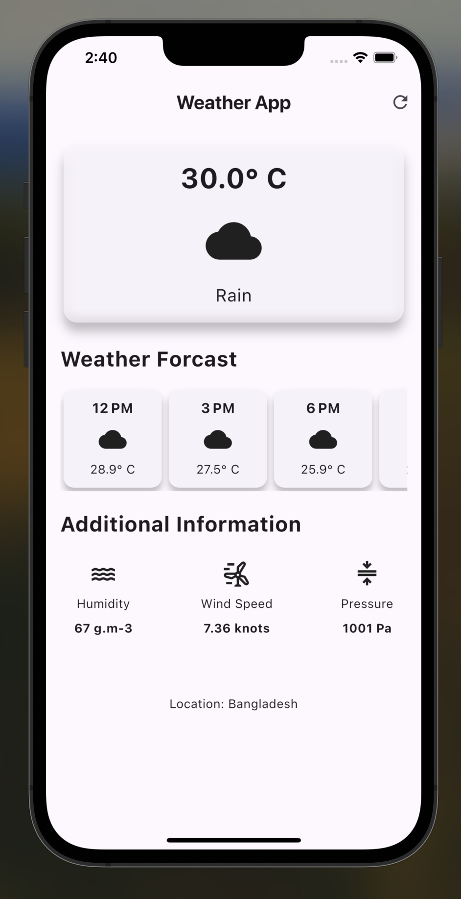

# weather_app

This is my second practice Flutter app, which focuses on displaying current weather and forecast information. The app is designed using Material Design principles and is built to work seamlessly across multiple platforms, providing a consistent and responsive user experience.

## Getting Started

